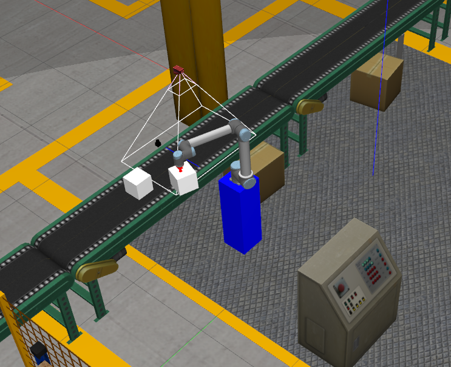
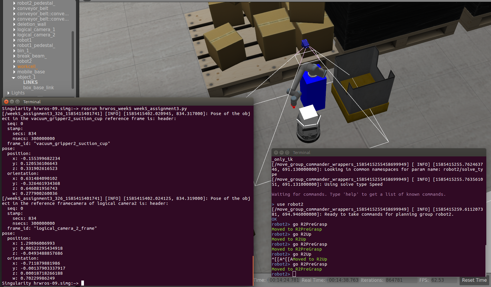
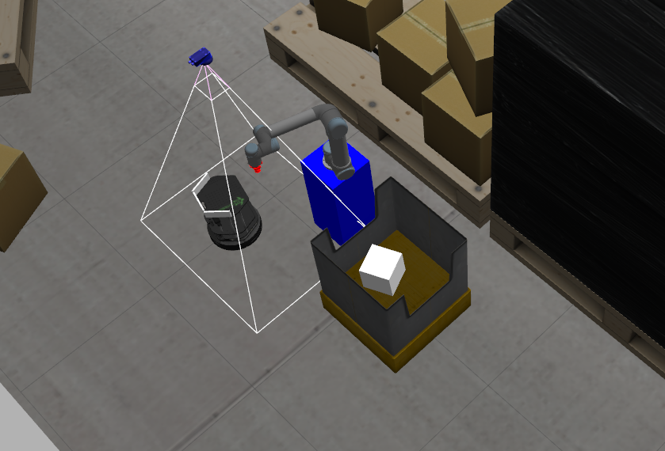
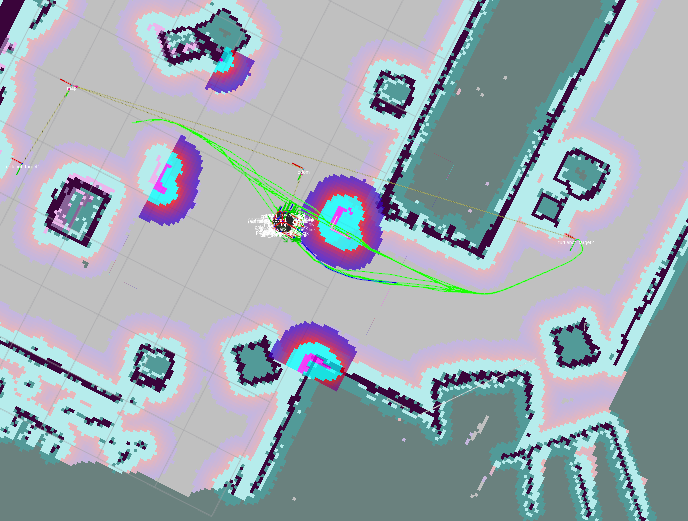
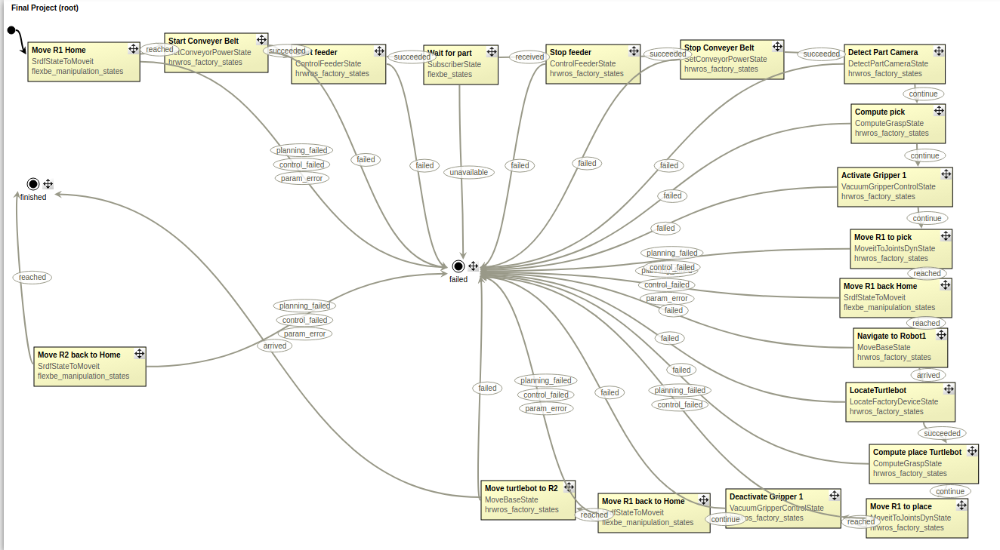

# ROS_factory_picknplace
ROS-based factory pipeline in gazebo, using UR arms, Turtlebot, FlexBE state architecture

## Basic Pipeline
One UR robot picks up boxes coming down the assembly line
The robot picks the box from the line and places it on the Turtlebot
The Turtlebot autonomously navigates from the assembly line location to another robot at the other end of the factory
The second UR robot picks up the box from the Turtlebot and places it in the crate
Rinse and Repeat!

## Media

### Picking up box from assembly line

### Before picking up box from Turtlebot

### After placing box in plate

### Turtlebot's amcl-based path planning and object avoidance

### Partially-complete FlexBE state machine

